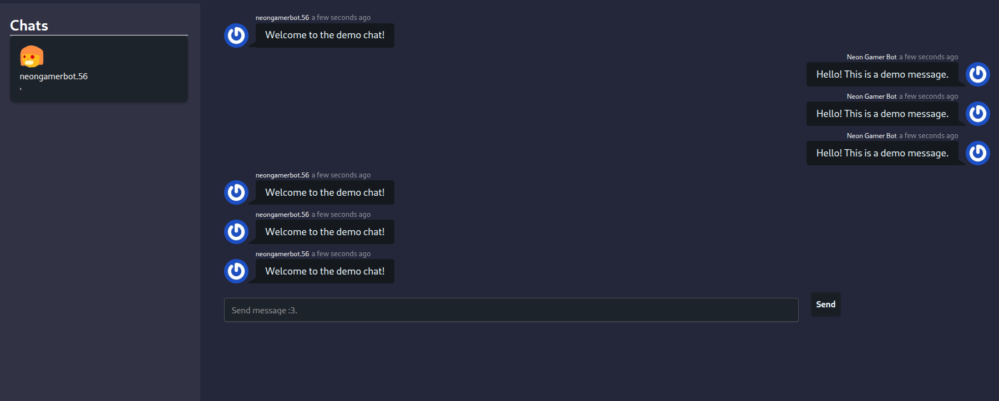

# Signal APP


Signal desktop but... on the web??
Look at the [Nuxt documentation](https://nuxt.com/docs/getting-started/introduction) to learn more.

## What really is this?

This is a project for shipwrecked but this ac project itself focus's on using signal-cli's features to use signal on a website :)
this is a unsecure and nice method to use signal on chromebooks :3

## Setup

Make sure to install dependencies:

```bash
# npm
npm install

# pnpm
pnpm install

# yarn
yarn install

# bun
bun install
```

## Development Server
1. Install signal-cli if you havent
2. link your account to signal-cli [How to do that here](https://github.com/AsamK/signal-cli?tab=readme-ov-file#usage)
3. Run `bash dev-dev-server.sh`  (stats the signal-cli running on the backend)
4. Start the development server on `http://localhost:3000`:

```bash
# npm
npm run dev

# pnpm
pnpm dev

# yarn
yarn dev

# bun
bun run dev
```
## Production

Build the application for production:

```bash
# npm
npm run build

# pnpm
pnpm build

# yarn
yarn build

# bun
bun run build
```

Locally preview production build:

```bash
# npm
npm run preview

# pnpm
pnpm preview

# yarn
yarn preview

# bun
bun run preview
```
